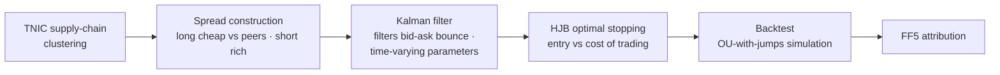

# Spread Trading via State-Space Modeling of Supply Chains

Statistical arbitrage on mega-caps: cluster firms by **supply-chain similarity (TNIC)**, extract the cointegrating spread with a **Kalman filter**, and time entries with **HJB optimal stopping** that weighs expected mean-reversion profit against real trading costs.

## What's in here
| Path | Contents |
|---|---|
| `src/` | Strategy: OU-with-jumps simulation, Kalman filtering, cointegration, HJB backtest |
| `notebooks/tvp_kalman_cointegration.ipynb` | **Time-varying-parameter Kalman** extension on a bank pair (RF/SCHW): letting the cointegration relation drift captures regime shifts a static filter misses |
| `research/` | Exploratory work |

## The honest result — and why it's the interesting part
Returns were **fully orthogonal to the Fama-French 5 factors** (genuinely idiosyncratic alpha source), but **net P&L was negative**: execution costs exceeded the slight mispricing of mega-caps. Two lessons I now apply everywhere:
1. **Costs are a first-class citizen** of strategy design, not an afterthought — which is why my [trading system](../../systematic-trading-system) has a band rebalancer and why my [thesis](../../rl-optimal-execution) is about execution cost itself.
2. A signal can be real and still not tradeable at your cost structure. Knowing the difference is the job.

## Economic logic
When systemic stress temporarily decouples firms that share supply-chain economics, the trade is compensation for **providing liquidity during the dislocation**, profiting as institutional capital forces prices back to equilibrium.
